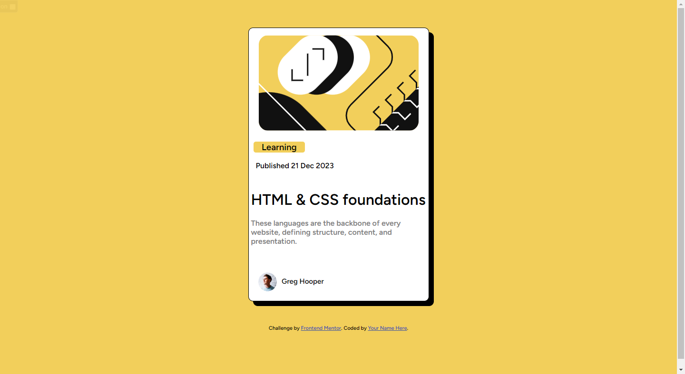

# Frontend Mentor - Blog preview card solution

This is a solution to the [Blog preview card challenge on Frontend Mentor](https://www.frontendmentor.io/challenges/blog-preview-card-ckPaj01IcS). Frontend Mentor challenges help you improve your coding skills by building realistic projects. 

## Table of contents

- [Overview](#overview)
  - [The challenge](#the-challenge)
  - [Screenshot](#screenshot)
  - [Links](#links)
- [My process](#my-process)
  - [Built with](#built-with)
  - [What I learned](#what-i-learned)
  - [Continued development](#continued-development)
  -

## Overview

### The challenge

Users should be able to:

- See hover and focus states for all interactive elements on the page

### Screenshot

### Links

- Solution URL: [Add solution URL here](https://your-solution-url.com)
- Live Site URL: [Add live site URL here](https://your-live-site-url.com)

## My process

### Built with

- Semantic HTML5 markup
- CSS custom properties
- Flexbox
-

### What I learned

I  learned how to use box-shadow in this one. i was confused at first how you get that dark shadow and i struggled a bit . so i finished the basics first and went to mdn to learn how it all works. like how thers an x-axis and y-axis and a blur effect and then color.

### Useful resources

- [Example resource 1](https://developer.mozilla.org/en-US/docs/Web/CSS/CSS_backgrounds_and_borders/Box-shadow_generator) - This helped me for the box-shadow css. I really liked this pattern and will use it going forward if needed.
- [Example resource 2](https://developer.mozilla.org/en-US/docs/Web/CSS/box-shadow) - This is an amazing article which helped me finally understand it. I'd recommend it to anyone still learning this concept.

